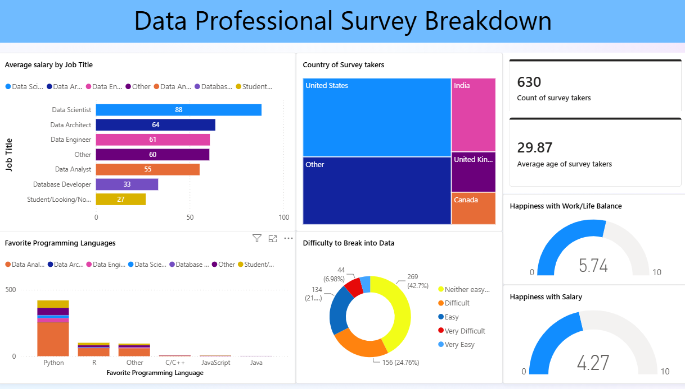

# 📊 Data Professional Survey Analysis | Power BI

## Overview

This project analyzes survey responses from data professionals across different countries and job roles using Microsoft Power BI.

The dashboard provides insights into salary trends, programming language preferences, work-life balance, career satisfaction, and the challenges faced while entering the data industry.

The project demonstrates data cleaning, data transformation, DAX calculations, and interactive dashboard design.

---

## Dataset

The dataset contains responses from **630+ data professionals** collected through an online survey.

Some of the information includes:

- Job Title
- Annual Salary
- Country
- Industry
- Programming Language
- Gender
- Age
- Education
- Career Switch Status
- Job Satisfaction
- Work-Life Balance
- Difficulty Breaking into Data

---

## Tools Used

- Microsoft Power BI
- Power Query
- DAX
- Microsoft Excel

---

## Dashboard Features

- Average Salary by Job Title
- Average Salary by Gender
- Favourite Programming Languages
- Country-wise Survey Distribution
- Career Switch Analysis
- Average Age of Respondents
- Work-Life Balance Rating
- Salary Satisfaction Rating
- Difficulty of Breaking into Data
- Interactive Filters (Slicers)

---

## Key Insights

- Data Scientists reported the highest average salaries among the surveyed roles.
- Python was the most preferred programming language.
- Most survey participants belonged to the United States.
- A significant number of professionals successfully transitioned into data careers from other fields.
- Work-life balance received better ratings than salary satisfaction.
- Many respondents reported that entering the data industry was moderately difficult.

---

## Dashboard Preview

---

## Files

| File | Description |
|------|-------------|
| Data-Professional-Survey-Breakdown.pbix | Power BI dashboard |
| Power BI - Final Project.xlsx | Survey dataset |
| Dashboard.png | Dashboard preview |

---

## Skills Demonstrated

- Data Cleaning
- Data Transformation
- Data Modeling
- DAX Measures
- Data Visualization
- Dashboard Design
- Business Insights
- Interactive Reporting

---

## Project Outcome

This dashboard transforms raw survey responses into meaningful business insights, allowing users to explore salary trends, programming language popularity, career transitions, and overall job satisfaction among data professionals.

---

### Connect with Me

**Amit Kumar**

GitHub: https://github.com/ak04amit

